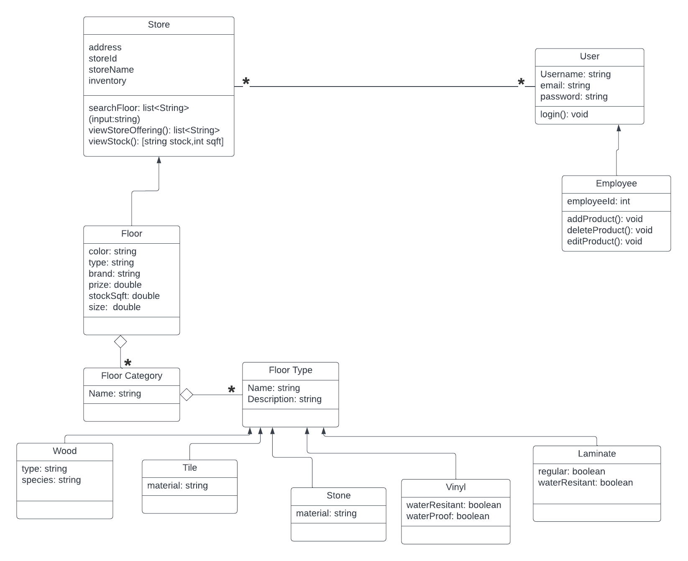
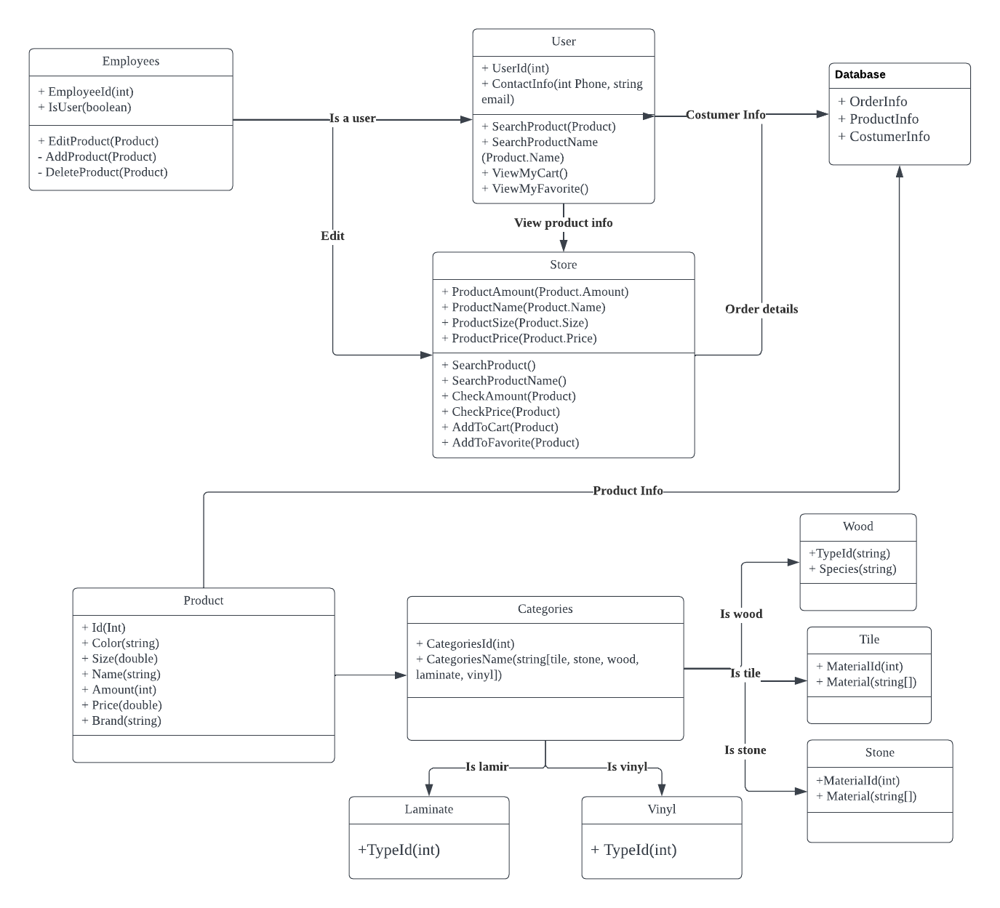
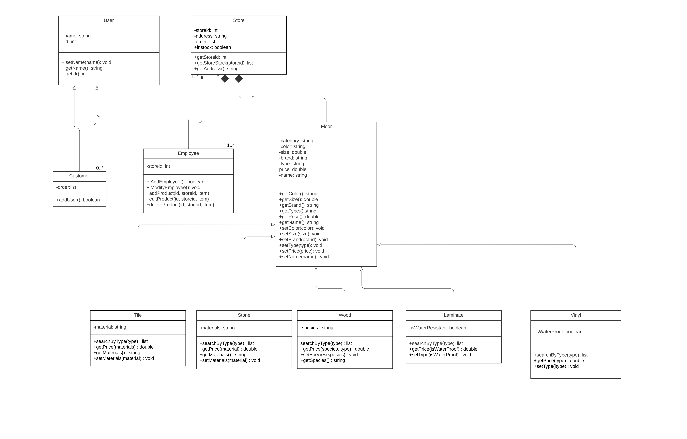
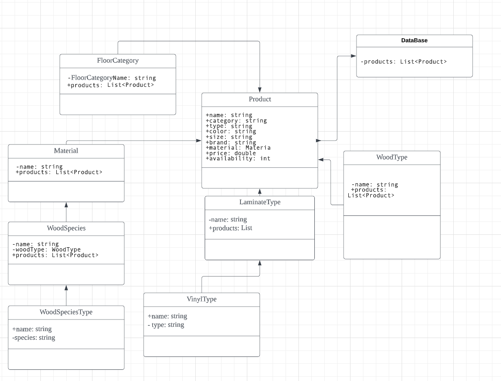
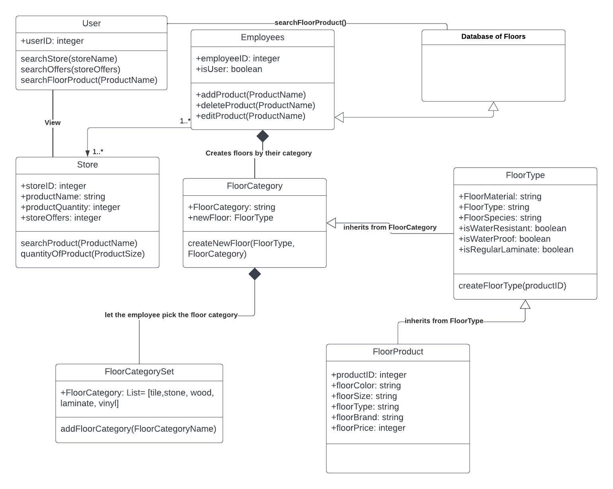
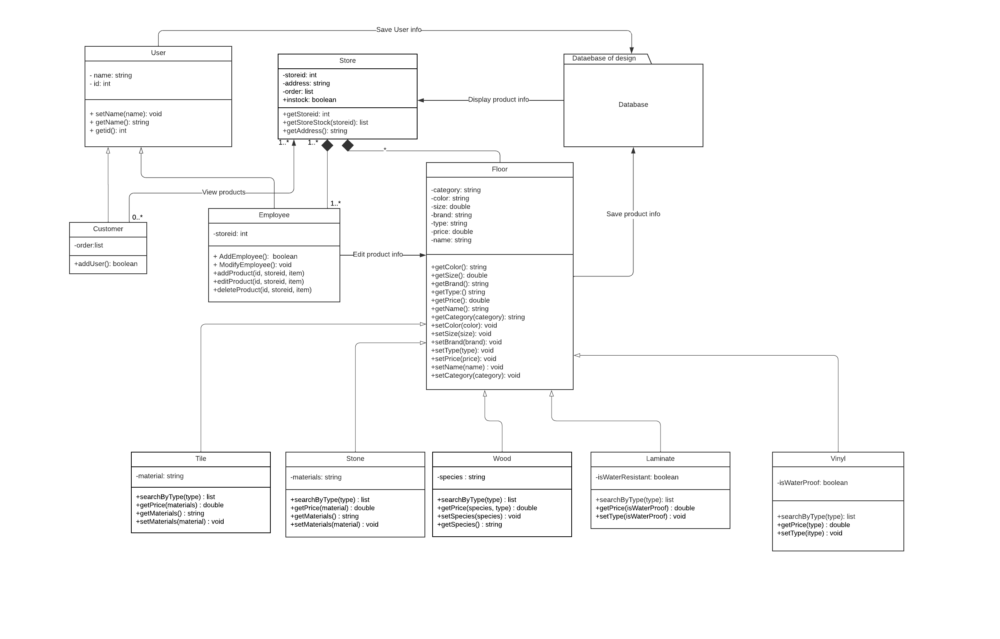

### Idividual Designs 

### Design 1(Jonn): 

Pro:
The Employee class inherits the User class.
Store Class holds the necessary attributes 

Con:
Floor class needs operations, such as get and set methods
Could also simplify the class structures, specifically Floor Type, wood, Tile, Stone, Vinyl, and Laminate don't need to be their own separate classes but can be embedded into the FloorCategory class under attributes and operations.
Store attributes don’t have their respective data types shown

### Design2(Daniel):

Pro:
Has a database that provides data and takes in data

Con:
Missing operations in Categories class
Does not show the cardinality between the classes, ex(Employee class to Store Class)

### Design 3(Dimi):

Pro:
Have all operations that can get and set attributes

Con:
In the Floor Class it should include Get() and Set() operations for the category of the floors
Doesn’t have Database class

### Design4 (gangjun)

Pro:
Has all the correct floor categories
All the attributes have a data type associated to them

Con:
No operations
Missing user class 
Did not label arrows
Does not have cardinality between classes

### Design5(Josh):

Pro:
The relation between classes are clear

Con:
Operations for all classes don't have a return value
Store Class needs to have a relationship to the floor classes.

b. Onesection for the team design, called “Team Design”, that shows the team design (as an embedded figure), discusses the main commonalities and differences between this design and the individual ones, and concisely justifies the main design decisions.

### Team design:

Commonalities between individual designs:
One main commonalities between the team design and most of the individual designs are that most of the individual designs follow a store hierarchy like our team design. 
Our UML diagrams also all included Employee classes.

Differences between Team Design and individual designs:
Our Team design included the cardinality relationship between most classes while most of the other designs included some cardinality relationships or none.
The Floor Class had the respective get() and set() operations for the Floor attributes
The Team Design included positives and negatives to the operations and attributes to indicate private or public domain.

c. Onefinal section, called “Summary”, that concisely summarizes the lessons learnt in the process of discussing the designs, in terms of design, team work, and any other aspect that the team members consider relevant.

It takes time to recruit all our team members together and also discuss all the pros and cons in different designs.
The Team Design included positives and negatives to the operations and attributes to indicate private or public domain.
We realized that we needed to use composition between the Employee class, the Floor class and the Store class, since we can’t have a store that doesn’t have floors or employees 
There were different conceptions of how the classes and ultimately the application were to operate. Certain class relationships were inefficient while others caused convoluted dependencies of interlocking classes which then lead to other problems with modularity. This required regular group meetings to ensure an open line of communication and an understanding of a unified UML design. We all decided to meet and demo our individual designs in our group meetings. We outlined the pros and cons of each design. Ideas were met with open considerations and then evaluated as if implemented in the final product！
Team work makes the dream work!!!

