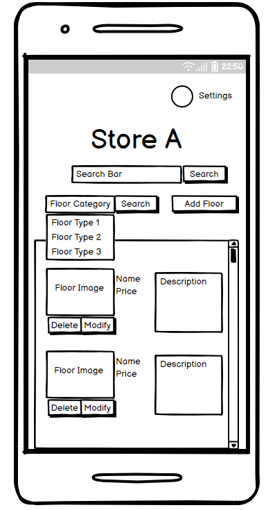

# Design Document
Author: Daniel, Dimitry, Gangjun, John, Josh

## 1 Design Considerations

### 1.1 Assumptions
We assume users are accessing the application with Android devices with Android API 24 or later version due the cumulative usage of users. The software will be dependent on the Nougat API and may not run optimally on older versions of Android. The software will be developed using Java.

### 1.2 Constraints
The application will be run on Android exclusive. There will not be an IOS, tablets or website version.

### 1.3 System Environment
The software will be developed for Android phone devices exclusively (tablets not included). The system must be able to interact with Android devices capable of receiving input through touch.

<<<<<<< HEAD
### 2 Architectural Design

### 2.1 Component Diagram
The Floor Product app is composed of four main components that work together to provide its full functionality. These components are the User Interface, Application Logic, Database, and Server. The User Interface component handles the display of the app's graphical interface and interacts with the Application Logic component. The Application Logic component is responsible for processing user requests and performing operations on the Database component. The Database component stores all the necessary information about the floor products in the inventory, while the Server component hosts the Database and provides access to it through a RESTful API.

Diagram:

### 2.2 Deployment Diagram

Given the simplicity of the application, our application contains a straightforward design which requires a user interface that displays the ability to create, modify, and view lists. From here, users will then be able to manage their lists and whatever items they may contain. The applications functionality ties to the applications SQLite database, which will allow for persistence as to save the users changes or modifications.

Diagram:

### 3 Low-Level Design
Our class diagram shows the necessary methods and attributes of the classes required for our system to interact as required.

### 3.1 Class Diagram
Diagram:

### 3.2 Other Diagram

Diagram:

### 4 User Interface Design

